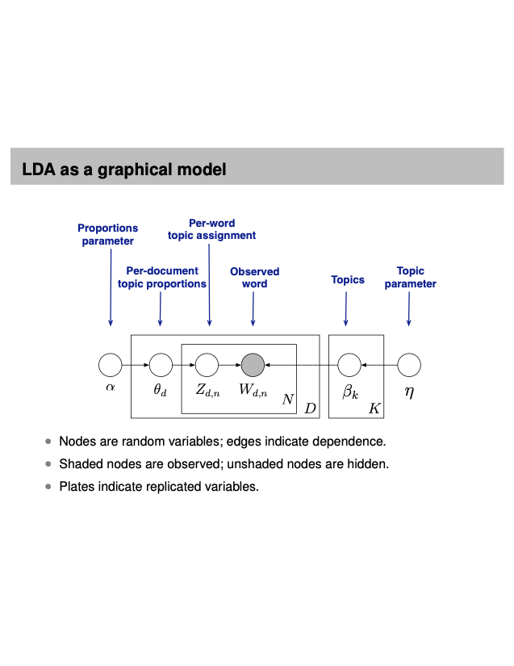

# CapstoneSentimentAnalysis
IISc CCE AI/ML Capstone Project - Topic based sentiment analysis

**Topic Modeling using LDA**

- LDA discovers themes using posterior inference. 
- LDA helps us discover hidden themes in documents.

 

**How does LDA Work?**

- LDA trades off 2 goals
  - In each document, allocate its words to few topics
  - In each topic, assign high probability to few terms.

- These 2 goals are at odds

- Trading off these goals finds groups of tightly co-occurring words.

     

